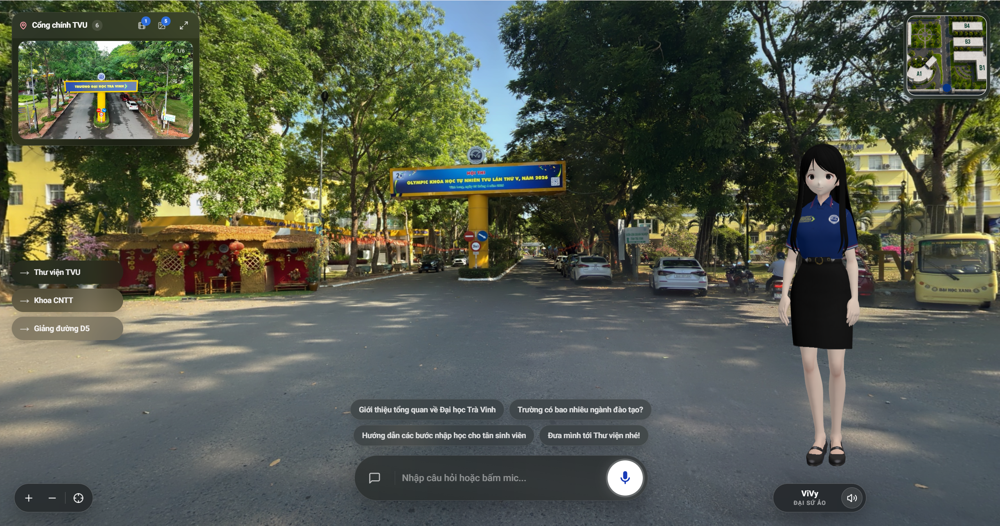
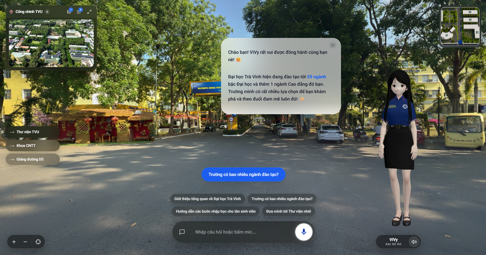
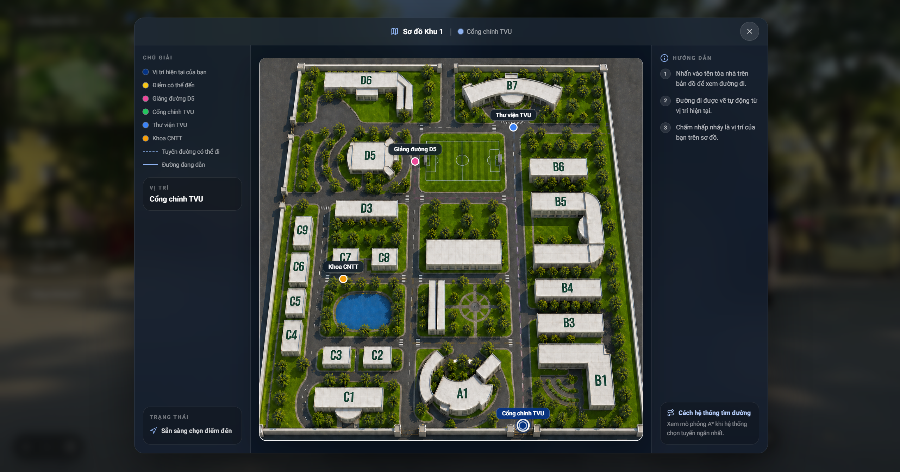
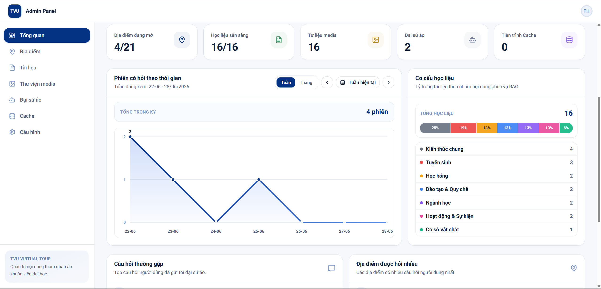
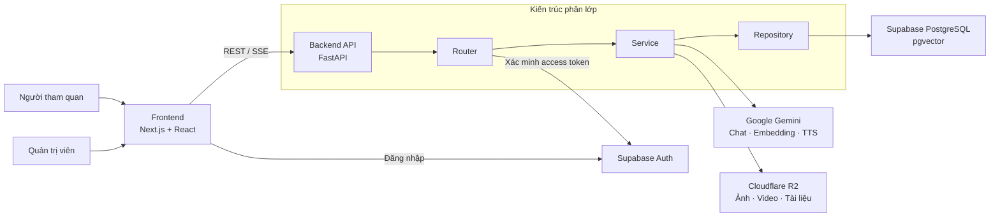
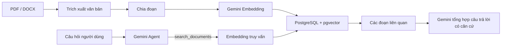

<div align="center">

# TVU Virtual Campus Tour

### Ứng dụng tham quan khuôn viên Đại học Trà Vinh bằng ảnh toàn cảnh 360° và trợ lý AI ViVy


</div>

## 1. Thông tin đồ án

| Nội dung | Thông tin |
|---|---|
| Tên đồ án | Ứng dụng tham quan khuôn viên Đại học Trà Vinh |
| Tên tiếng Anh | TVU Virtual Campus Tour |
| Sinh viên thực hiện | Nguyễn Thanh Hiểu |
| Mã số sinh viên | 110122221 |
| Lớp | DA22TTA |
| Repository nộp bài | `tn-da22tta-110122221-nguyenthanhhieu-tvutour` |
| Video demo | [Xem video trình diễn hệ thống trên Google Drive](https://drive.google.com/drive/folders/1xHmkKiam8fIFhoG9Mmh9xhfhsHYsqel7?usp=sharing) |

## 2. Giới thiệu

TVU Virtual Campus Tour là ứng dụng web hỗ trợ người dùng tham quan khuôn viên Đại học Trà Vinh từ xa thông qua ảnh toàn cảnh 360°. Người dùng có thể quan sát không gian, chuyển giữa các địa điểm, xem bản đồ và tìm tuyến đường ngắn nhất trong khuôn viên.

Ứng dụng tích hợp **ViVy**, đại sứ sinh viên nữ của TVU dưới dạng trợ lý AI. ViVy sử dụng Google Gemini kết hợp với kỹ thuật Retrieval-Augmented Generation (RAG) để trả lời câu hỏi dựa trên tài liệu thực tế của nhà trường. Trợ lý còn có thể điều khiển giao diện thông qua Function Calling, chẳng hạn dẫn người dùng đến địa điểm, mở hình ảnh/video hoặc hiển thị bản đồ.

## 3. Mục tiêu

- Xây dựng trải nghiệm tham quan khuôn viên TVU trực quan trên nền tảng web bằng ảnh panorama 360°.
- Cung cấp bản đồ tương tác và tìm tuyến đường ngắn nhất giữa các địa điểm bằng thuật toán A*.
- Hỗ trợ người dùng tra cứu thông tin về trường thông qua hội thoại văn bản và giọng nói với trợ lý AI ViVy.
- Giảm hiện tượng AI trả lời thiếu căn cứ bằng cách truy xuất ngữ cảnh từ kho tài liệu TVU qua RAG và pgvector.
- Cung cấp trang quản trị để cập nhật địa điểm, media, tài liệu, nhân vật 3D và dữ liệu cache mà không cần sửa trực tiếp mã nguồn.
- Xây dựng kiến trúc có thể triển khai trên hạ tầng thật với Supabase, Cloudflare R2 và Docker.

## 4. Chức năng chính

### Dành cho người tham quan

- Xem và tương tác với không gian panorama 360°.
- Chuyển giữa các địa điểm trong khuôn viên.
- Xem bản đồ, vị trí hiện tại và tuyến đường đến địa điểm đích.
- Tìm đường bằng A* và xem mô phỏng các bước duyệt của thuật toán.
- Trò chuyện với ViVy bằng văn bản.
- Nhận câu trả lời dạng streaming qua Server-Sent Events (SSE).
- Nghe câu trả lời bằng giọng nói với Gemini TTS hoặc `edge-tts` dự phòng.
- Xem hình ảnh, video và thông tin liên quan đến từng địa điểm.
- Sử dụng giao diện kiosk với cơ chế tự quay lại trạng thái chờ.

### Dành cho quản trị viên

- Đăng nhập bằng Supabase Auth.
- Quản lý địa điểm, trạng thái hiển thị, ảnh 360°, lời giới thiệu và câu hỏi gợi ý.
- Quản lý liên kết điều hướng và dữ liệu bản đồ.
- Quản lý hình ảnh/video của địa điểm trên Cloudflare R2.
- Tải lên, phân loại, theo dõi xử lý và xóa tài liệu RAG.
- Quản lý mô hình nhân vật 3D, giọng đọc và phong cách hội thoại.
- Tạo, theo dõi, hủy và kiểm tra nhật ký các tác vụ cache.

### Hình ảnh minh họa

#### Giao diện tham quan panorama 360° và nhân vật ViVy



#### Trợ lý AI ViVy trả lời câu hỏi của người tham quan



#### Bản đồ khuôn viên và chức năng tìm đường bằng A*



#### Dashboard quản trị hệ thống



## 5. Kiến trúc hệ thống



Backend tuân theo mô hình **Router → Service → Repository**:

| Tầng | Trách nhiệm |
|---|---|
| Router | Khai báo REST API, nhận và kiểm tra dữ liệu đầu vào, xác thực yêu cầu quản trị |
| Service | Xử lý nghiệp vụ: hội thoại AI, RAG, A*, TTS, ingest tài liệu, media và cache |
| Repository | Truy vấn bất đồng bộ tới PostgreSQL thông qua SQLAlchemy và `asyncpg` |
| Database | Lưu địa điểm, liên kết, media, tài liệu, vector embedding, phiên chat và cấu hình |

### Luồng RAG



### AI Agent Tools

ViVy sử dụng Gemini Function Calling với bốn công cụ đang hoạt động:

| Tool | Chức năng |
|---|---|
| `navigate_to` | Dẫn người dùng tới một địa điểm khác bằng slug hợp lệ |
| `show_media` | Mở hình ảnh, video hoặc toàn bộ media của địa điểm |
| `toggle_map` | Mở hoặc đóng bản đồ khuôn viên |
| `search_documents` | Tìm kiếm nội dung liên quan trong kho tài liệu RAG |

## 6. Công nghệ sử dụng

| Thành phần | Công nghệ |
|---|---|
| Frontend | Next.js 16.2, React 19.2, TypeScript 5, Tailwind CSS 4 |
| Panorama 360° | Pannellum |
| Nhân vật và phần tử 3D | Three.js, React Three Fiber, React Three Drei |
| Giao diện và animation | shadcn/ui, Base UI, Framer Motion, Lucide React |
| Quản lý trạng thái | Zustand |
| Backend | FastAPI, Python 3.11, Pydantic 2 |
| API | RESTful API, Server-Sent Events (SSE) |
| ORM và kết nối CSDL | SQLAlchemy 2 Async, asyncpg |
| Cơ sở dữ liệu | PostgreSQL, pgvector, Supabase |
| AI | Google Gemini: chat, Function Calling, embedding và TTS |
| TTS dự phòng | edge-tts |
| Xử lý tài liệu | pdfplumber, python-docx |
| Lưu trữ đối tượng | Cloudflare R2 qua giao thức S3-compatible và boto3 |
| Đóng gói backend | Docker, Docker Compose |

## 7. Các API chính

Sau khi backend chạy, tài liệu OpenAPI có tại `http://localhost:8000/api/docs`.

| Phương thức | Endpoint | Mô tả |
|---|---|---|
| `GET` | `/api/health` | Kiểm tra trạng thái backend |
| `GET` | `/api/locations` | Lấy danh sách địa điểm đang hoạt động |
| `GET` | `/api/locations/{slug}` | Lấy chi tiết một địa điểm |
| `GET` | `/api/locations/{slug}/assets` | Lấy media gắn với địa điểm |
| `GET` | `/api/locations/{slug}/questions` | Lấy câu hỏi gợi ý của địa điểm |
| `POST` | `/api/chat` | Hội thoại với ViVy; hỗ trợ JSON, SSE và TTS |
| `POST` | `/api/chat/session` | Tạo phiên hội thoại |
| `POST` | `/api/tts` | Tạo âm thanh từ văn bản |
| `GET` | `/api/nav/graph` | Lấy đồ thị điều hướng gồm nodes và edges |
| `GET` | `/api/nav/path?from=...&to=...` | Tìm tuyến đường ngắn nhất bằng A* |
| Nhiều phương thức | `/api/admin/*` | Quản trị địa điểm, media, tài liệu, nhân vật và cấu hình |
| Nhiều phương thức | `/api/admin/cache/*` | Quản lý tác vụ và hiện vật cache |

Các endpoint `/api/admin/*` yêu cầu access token hợp lệ từ Supabase Auth.

## 8. Cấu trúc repository

```text
tn-da22tta-110122221-nguyenthanhhieu-tvutour/
├── README.md
├── docker-compose.yml           # Docker Compose gom backend + frontend
├── docs/
│   ├── KhoaLuan_NguyenThanhHieu_110122221.docx
│   ├── KhoaLuan_NguyenThanhHieu_110122221.pdf
│   ├── KhoaLuan-Slide.pptx
│   └── TVU_AI_Agent_Poster_A1.pdf
└── src/
    ├── backend/
    │   ├── app/
    │   │   ├── ai/             # Gemini, embedding, TTS và Function Calling
    │   │   ├── db/             # Kết nối và bảng SQLAlchemy
    │   │   ├── repositories/   # Truy cập dữ liệu
    │   │   ├── routers/        # REST API
    │   │   ├── schemas/        # Kiểu dữ liệu request/response
    │   │   └── services/       # Nghiệp vụ RAG, A*, storage và cache
    │   ├── data/                # Đồ thị điều hướng và dữ liệu tĩnh runtime
    │   ├── scripts/             # Khởi tạo CSDL, seed và tiện ích quản trị
    │   ├── tests/
    │   ├── .env.example
    │   ├── Dockerfile
    │   └── requirements.txt
    └── frontend/
        ├── public/              # Ảnh 360°, bản đồ, audio và mô hình 3D
        ├── src/                 # App Router, features, components và stores
        ├── .env.example
        ├── Dockerfile
        ├── package.json
        └── next.config.ts
```

Mã nguồn khởi tạo cấu trúc PostgreSQL, extension pgvector và các chỉ mục vector nằm tại `src/backend/scripts/migrate.py`. Dữ liệu địa điểm mẫu có thể được thêm bằng `src/backend/scripts/seed.py`.

## 9. Yêu cầu hệ thống

### Bắt buộc

| Phần mềm/dịch vụ | Phiên bản hoặc yêu cầu |
|---|---|
| Git | Phiên bản hiện hành |
| Node.js | **Từ 20.9.0** theo yêu cầu của Next.js 16.2.4 |
| npm | Đi kèm Node.js |
| Python | Từ 3.11 |
| PostgreSQL | Khuyến nghị PostgreSQL 15 trở lên |
| pgvector | Extension phải được bật trong PostgreSQL |
| Google Gemini API | API key để dùng chat, embedding và Gemini TTS |
| Supabase | PostgreSQL và Auth |
| Cloudflare R2 | Lưu ảnh, video, mô hình và tài liệu của hệ thống |

### Tùy chọn

- Docker Desktop hoặc Docker Engine kèm Docker Compose để chạy toàn bộ hệ thống trong container.
- Tài khoản Supabase Auth hợp lệ để truy cập trang quản trị.

## 10. Cấu hình biến môi trường

Không commit file `.env`, `.env.local`, Supabase service role key, Gemini API key hoặc khóa Cloudflare R2 lên GitHub. Repository chỉ lưu các file `.env.example` không chứa thông tin bí mật.

### Backend — `src/backend/.env`

Tạo file từ mẫu:

```powershell
cd src/backend
Copy-Item .env.example .env
```

Trên macOS/Linux:

```bash
cd src/backend
cp .env.example .env
```

Các nhóm biến chính:

| Biến | Bắt buộc | Ý nghĩa |
|---|---:|---|
| `APP_NAME`, `APP_VERSION` | Không | Tên và phiên bản hiển thị của API |
| `DEBUG` | Không | Bật log/chế độ phát triển; nên là `false` khi triển khai |
| `CORS_ORIGINS` | Có | Danh sách JSON các origin frontend được phép gọi API |
| `GEMINI_API_KEY` | Có cho AI | Khóa Google Gemini |
| `GEMINI_AGENT_MODEL` | Không | Mô hình xử lý quyết định gọi tool |
| `GEMINI_ANSWER_MODEL` | Không | Mô hình tổng hợp câu trả lời có ngữ cảnh |
| `GEMINI_AGENT_THINKING_LEVEL` | Không | Mức suy luận cho lượt agent |
| `GEMINI_ANSWER_THINKING_LEVEL` | Không | Mức suy luận cho lượt trả lời |
| `GEMINI_EMBEDDING_MODEL` | Không | Mô hình embedding tài liệu và câu hỏi |
| `GEMINI_EMBEDDING_DIMENSIONS` | Không | Số chiều vector; schema hiện dùng `768` |
| `GEMINI_TTS_MODEL`, `GEMINI_DEFAULT_VOICE` | Không | Mô hình và giọng Gemini TTS mặc định |
| `TTS_LOCAL_CACHE_ENABLED` | Không | Cho phép lưu file TTS được sinh trong máy chủ |
| `DATABASE_URL` | Có | Chuỗi kết nối dạng `postgresql+asyncpg://...` |
| `SUPABASE_URL`, `SUPABASE_ANON_KEY` | Có | Xác thực access token từ Supabase Auth |
| `SUPABASE_SERVICE_ROLE_KEY` | Chỉ phía server | Khóa đặc quyền; tuyệt đối không đưa vào frontend |
| `R2_ENDPOINT_URL` | Có cho media | S3 endpoint của Cloudflare R2 |
| `R2_ACCESS_KEY_ID`, `R2_SECRET_ACCESS_KEY` | Có cho media | Cặp khóa truy cập R2 |
| `R2_BUCKET_NAME` | Có cho media | Tên bucket lưu trữ |
| `R2_PUBLIC_URL` | Khuyến nghị | Domain public/CDN dùng để phân phối media |

> `CORS_ORIGINS` phải là một mảng JSON, ví dụ `CORS_ORIGINS=["http://localhost:3000","https://example.com"]`.

### Frontend — `src/frontend/.env`

```powershell
cd src/frontend
Copy-Item .env.example .env
```

| Biến | Bắt buộc | Ý nghĩa |
|---|---:|---|
| `NEXT_PUBLIC_API_URL` | Có | URL backend, ví dụ `http://localhost:8000` |
| `NEXT_PUBLIC_R2_URL` | Không | URL public Cloudflare R2; mặc định `https://tvu-tour.site` |
| `NEXT_PUBLIC_SUPABASE_URL` | Có | URL dự án Supabase |
| `NEXT_PUBLIC_SUPABASE_ANON_KEY` | Có | Anon key dành cho ứng dụng frontend |
| `NEXT_PUBLIC_KIOSK_MODE` | Không | Đặt `true` để bật hành vi dành cho kiosk |

`NEXT_PUBLIC_*` được đóng gói vào mã JavaScript gửi đến trình duyệt. Không đặt service role key hoặc các khóa bí mật vào những biến này.

## 11. Cách chạy chương trình

Mở hai cửa sổ terminal: một cho backend và một cho frontend.

### Bước 1 — Chuẩn bị Supabase/PostgreSQL

1. Tạo dự án Supabase hoặc một PostgreSQL có cài extension pgvector.
2. Lấy chuỗi kết nối PostgreSQL tương thích `asyncpg` và điền vào `DATABASE_URL`.
3. Điền Supabase URL và keys vào file môi trường của backend/frontend.
4. Từ thư mục `src/backend`, khởi tạo bảng và chỉ mục:

```powershell
python -m scripts.migrate
```

5. Nếu cần dữ liệu minh họa tối thiểu, chạy lệnh sau một lần:

```powershell
python -m scripts.seed
```

> Script seed chỉ thêm dữ liệu khi bảng địa điểm đang trống. Media và tài liệu RAG đầy đủ cần được cấu hình từ trang quản trị hoặc khôi phục từ dữ liệu triển khai của đồ án.

### Bước 2 — Chạy backend

```powershell
cd src/backend

py -3.11 -m venv .venv
Set-ExecutionPolicy -Scope Process -ExecutionPolicy Bypass
.\.venv\Scripts\Activate.ps1

python -m pip install --upgrade pip
pip install -r requirements.txt

Copy-Item .env.example .env
# Chỉnh sửa .env trước khi tiếp tục

uvicorn app.main:app --reload --host 0.0.0.0 --port 8000
```

Trên macOS/Linux, thay phần tạo và kích hoạt môi trường ảo bằng:

```bash
python3.11 -m venv .venv
source .venv/bin/activate
```

Kiểm tra backend:

```powershell
Invoke-RestMethod http://localhost:8000/api/health
```

### Bước 3 — Chạy frontend

```powershell
cd src/frontend

npm ci
Copy-Item .env.example .env
# Chỉnh sửa .env trước khi tiếp tục

npm run dev
```

Truy cập:

- Ứng dụng tham quan: <http://localhost:3000>
- Trang đăng nhập quản trị: <http://localhost:3000/admin/login>
- OpenAPI/Swagger: <http://localhost:8000/api/docs>
- Health check: <http://localhost:8000/api/health>

## 12. Chạy bằng Docker (tùy chọn)

Repository có `docker-compose.yml` ở thư mục gốc để khởi chạy cả backend và frontend trong container.

```powershell
# Tạo file .env cho backend
cd src/backend
Copy-Item .env.example .env
# Điền đầy đủ cấu hình trong .env rồi quay lại thư mục gốc
cd ../..

# Khởi chạy toàn bộ hệ thống
docker compose up -d --build
docker compose ps
```

Sau khi container hoạt động:
- Backend API: `http://localhost:8000`
- Frontend: `http://localhost:3000`

Nếu cơ sở dữ liệu chưa được khởi tạo, chạy:

```powershell
docker compose run --rm backend python -m scripts.migrate
docker compose run --rm backend python -m scripts.seed
```

Xem log:

```powershell
docker compose logs -f
```

Dừng container:

```powershell
docker compose down
```

Docker Compose ánh xạ backend ra cổng `8000`, frontend ra cổng `3000`, và kiểm tra sức khỏe backend qua `/api/health`.

## 13. Build và kiểm tra chất lượng

### Backend

```powershell
cd src/backend
pip install pytest pytest-asyncio
python -m compileall app
pytest -q tests
```

### Frontend

```powershell
cd src/frontend
npm run lint
npm run build
npm run start
```

## 14. Lưu ý

- Đổi `CORS_ORIGINS` sang domain frontend thật.
- Đặt `NEXT_PUBLIC_API_URL` thành URL HTTPS của backend.
- Chỉ lưu khóa bí mật trong secret manager hoặc file `.env` trên server.
- Không sử dụng Supabase service role key ở frontend.
- Bật pgvector trước khi ingest tài liệu RAG.
- Cấu hình bucket R2 và public/custom domain để trình duyệt tải được ảnh 360°, video và mô hình 3D.
- Tạo ít nhất một tài khoản trong Supabase Auth để đăng nhập trang quản trị.
- Không commit thư mục `node_modules`, `.next`, `.venv` hoặc cache TTS.

## 15. Xử lý lỗi thường gặp

| Hiện tượng | Cách kiểm tra |
|---|---|
| Frontend không gọi được API | Kiểm tra `NEXT_PUBLIC_API_URL`, backend cổng `8000` và `CORS_ORIGINS` |
| Chat AI không hoạt động | Kiểm tra `GEMINI_API_KEY`, quota API và tên các Gemini model |
| Ingest tài liệu lỗi | Kiểm tra pgvector, `GEMINI_EMBEDDING_MODEL`, số chiều vector `768` và kết nối database |
| Trang admin trả về `401` | Đăng nhập lại và kiểm tra Supabase URL/anon key ở cả frontend lẫn backend |
| Không tải được media | Kiểm tra R2 credentials, bucket, public URL và quyền truy cập object |
| Docker báo `unhealthy` | Chạy `docker compose logs -f api` và gọi trực tiếp `/api/health` |

## 16. Tài liệu và video demo

- Quyển đồ án định dạng Word: [`docs/KhoaLuan_NguyenThanhHieu_110122221.docx`](docs/KhoaLuan_NguyenThanhHieu_110122221.docx)
- Quyển đồ án định dạng PDF: [`docs/KhoaLuan_NguyenThanhHieu_110122221.pdf`](docs/KhoaLuan_NguyenThanhHieu_110122221.pdf)
- Slide bảo vệ: [`docs/KhoaLuan-Slide.pptx`](docs/KhoaLuan-Slide.pptx)
- Poster A1: [`docs/TVU_AI_Agent_Poster_A1.pdf`](docs/TVU_AI_Agent_Poster_A1.pdf)
- Video demo: [Google Drive — TVU Virtual Campus Tour](https://drive.google.com/drive/folders/1xHmkKiam8fIFhoG9Mmh9xhfhsHYsqel7?usp=sharing)

---

<div align="center">

**Đồ án tốt nghiệp — Nguyễn Thanh Hiểu — DA22TTA — Đại học Trà Vinh**

</div>
